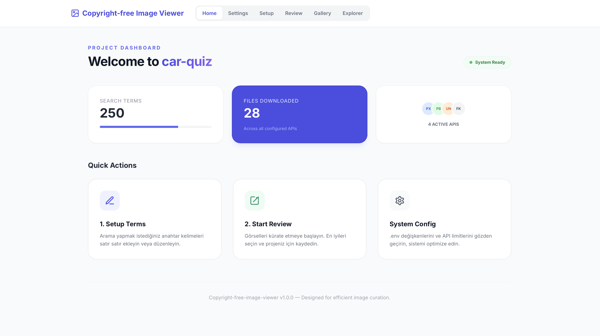
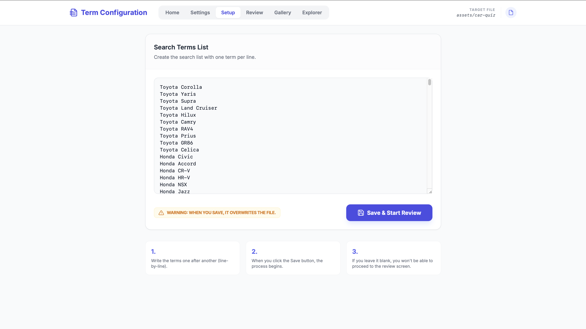
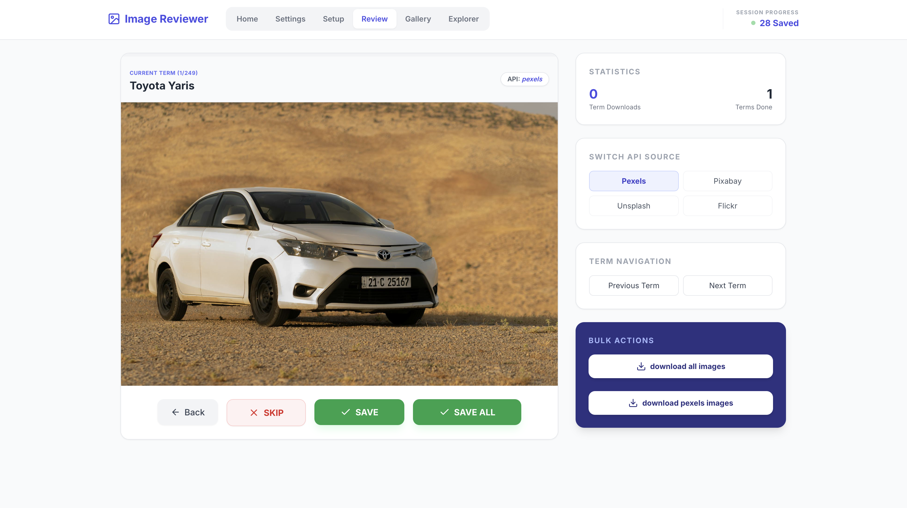
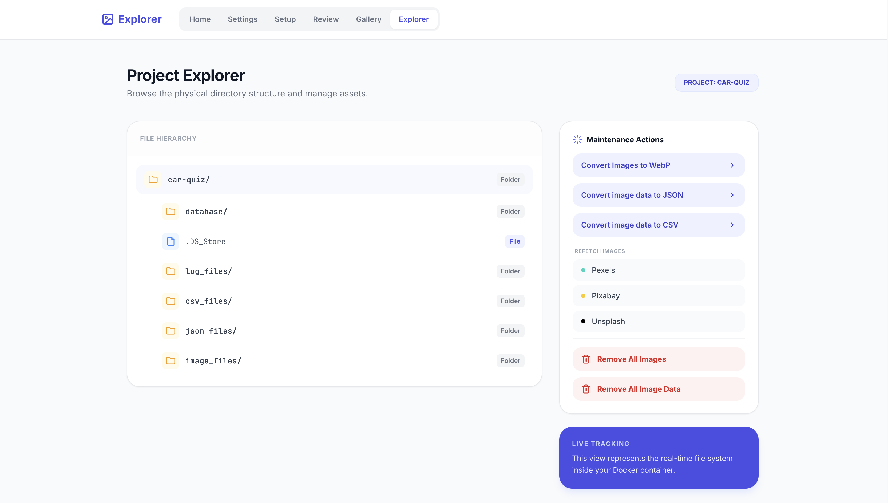
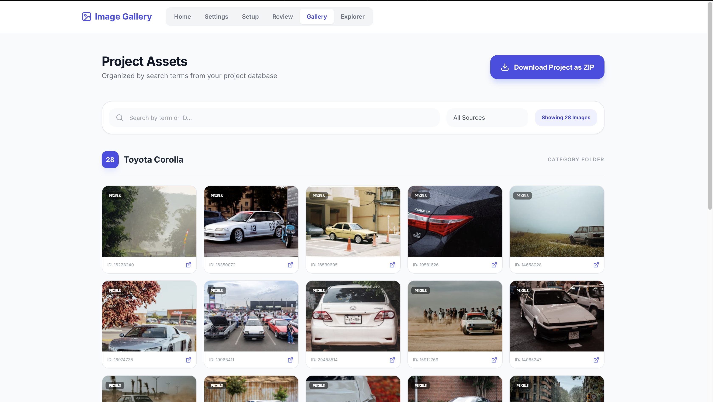

# 📸 copyright-free-image-viewer


**Copyright-free-image-viewer** is a robust, open-source media procurement and curation platform. It unifies search, review, and asset management processes into a single, elegant interface, connecting seamlessly to major stock image providers (Pexels, Pixabay, Unsplash, Flickr) to streamline your creative workflow.

## 🚀 Key Features

### 🔍 Unified Search & Curation
- **Multi-API Support**: Fetch high-quality images simultaneously from **Pexels**, **Pixabay**, **Unsplash**, and **Flickr**.
- **Smart Queue**: Automatic deduplication and session management ensure you never review the same image twice.
- **Tinder-Style Review**: Rapidly build your collection with a "Yes/No" swipe interface designed for speed.

### 📂 Advanced Asset Explorer
- **Visual File System**: Browse your project's physical directory structure directly from the web interface.
- **Maintenance Actions**:
  - **WebP Conversion**: Batch convert your entire library to optimized WebP format with one click.
  - **Refetch**: Automatically replenish your queue for specific terms from any API source.
  - **Data Export**: Export your entire database metadata to **JSON** or **CSV** formats for external analysis.

### 🖼️ Dynamic Gallery
- **Filtering**: Powerful search bar to filter assets by image ID, source API, or keyword tags.
- **Management**: Delete individual images or bulk-clear entire categories.
- **Download**: One-click **ZIP** export of your curated selection for immediate use in projects.

### 🛠️ Production Ready
- **Dockerized**: specific `docker-compose` setup for instant, reproducible deployments.
- **Robust Logging**: Detailed logging system tracks every API call, download, and error for total transparency.
- **Database Persistence**: SQLite integration ensures your curation decisions and metadata are safely stored.

---

## 🛠 Installation & Setup

### Option 1: Docker (Recommended)
The fastest way to get started. ensuring a clean environment.

1. **Clone the repository:**
   ```bash
   git clone https://github.com/AtaCanYmc/copyright-free-image-viewer.git
   cd copyright-free-image-viewer
   ```

2. **Configure Environment:**
   Create a `.env` file in the root directory (use `.env.example` as a template):
   ```env
   # API Keys (Get these from respective developer portals)
   PEXELS_API_KEY=your_key_here
   PIXABAY_API_KEY=your_key_here
   UNSPLASH_ACCESS_KEY=your_key_here
   FLICKR_API_KEY=your_key_here

   # Configuration
   APP_PORT=8080
   DEBUG=True
   ```

3. **Launch:**
   ```bash
   docker-compose up --build
   ```
   Visit **http://localhost:8080** to start curating.

### Option 2: Local Python Setup

1. **Install Dependencies:**
   ```bash
   pip install -r requirements.txt
   ```

2. **Run Application:**
   ```bash
   python app.py <project_name>
   ```

---

## 📖 Usage Workflow

### 1. Project Setup

- **Launch**: Start the app and define your project name via command line argument `python app.py <project_name>`.
- **Dashboard**: The Home screen gives you a quick overview of your progress, including total search terms and downloaded files across all APIs.
- **Setup Terms**: Navigate to **Setup** to input the keywords you want to search for (e.g., "mountain landscape", "cyberpunk city"). These terms drive the initial image fetching process.



### 2. Curation (Review)

- **Tinder-Style Review**: Go to the **Review** tab to see live results.
- **Swipe Actions**:
  - **Save (Green Button)**: Downloads the high-res image to your local project folder.
  - **Save All (Green Button)**: Batch downloads all currently loaded images for the term.
  - **Skip (Red Button)**: Discards the image and moves to the next.
- **Switch API**: Toggle specific providers (Pexels, Pixabay, etc.) on the right panel to find the best results for your specific detailed terms.

### 3. Management (Explorer)

- **File System View**: The **Explorer** tab mirrors your actual local directory structure (`assets/<project_name>`).
- **Maintenance Actions**:
  - **Convert to WebP**: Run a batch process to convert all downloaded JPG/PNGs to WebP for 30-50% storage savings.
  - **Refetch Images**: If you need more variety, trigger a background refetch for specific APIs.
  - **Data Export**: Generate `images.csv` or `images.json` containing metadata (IDs, source URLs, tags) for all approved assets.


### 4. Final Review & Export (Gallery)

- **Visual Verification**: The **Gallery** displays all your "Approved" assets in a masonry layout.
- **Search & Filter**: Use the dynamic search bar to find specific images by ID or Source.
- **Delete**: Remove unwanted assets from both disk and database.
- **Download**: Click **"Download Project as ZIP"** in the header to bundle everything for your creative work.

---

## ⚙️ Advanced Configuration (`.env`)

Fine-tune the application behavior by editing your `.env` file:

| Variable | Default | Description |
| :--- | :--- | :--- |
| `PROJECT_NAME` | `my_project` | Default project name if not specified in CLI. |
| `APP_PORT` | `8080` | Port to run the web server on. |
| `DEBUG` | `False` | Enable Flask debug mode (auto-reload). |
| `DOWNLOAD_IMAGES` | `True` | Set to `False` to only save metadata without downloading files. |
| `MAX_KB_IMAGE_SIZE` | `512` | Warn or resize if images exceed this size (kb). |
| `WEBP_COMPRESSION_QUALITY` | `80` | Quality level (0-100) for WebP conversion tool. |
| `SEARCH_PER_PAGE` | `30` | Number of images to fetch per API request page. |
| `MIN_IMAGES_PER_TERM` | `1` | Minimum approved images required to mark a term as "Done". |

---

## 🤝 Contributing

We welcome contributions to make Copyright-free-image-viewer even better!

1. Fork the Project
2. Create your Feature Branch (`git checkout -b feature/AmazingFeature`)
3. Commit your Changes (`git commit -m 'Add some AmazingFeature'`)
4. Push to the Branch (`git push origin feature/AmazingFeature`)
5. Open a Pull Request

---

## 📄 License

Distributed under the MIT License. See `LICENSE` for more information.

---

<p align="center">
  Built with ❤️ by Open Source Contributors
</p>